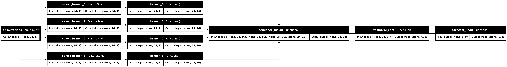


Predictor Modular Temporal
==========================

The model is composed from independently configurable temporal branches, a
sequence fusion layer, a Transformer core, and a task head. The public import
path remains ``predictor_plugins.modular_temporal``.

Default architecture
--------------------

For hourly input, ``default_config(feature_names)`` creates a 24-hour window
and one branch for each named input feature. A branch applies a causal Conv1D
with 16 channels and kernel size 3, preserving all 24 time steps. Fusion
concatenates branch channels at those shared time positions. The core adds
sinusoidal positional encoding, projects each time step to 64 channels,
applies two causal Transformer blocks with four attention heads and 128-wide
feed-forward layers, then uses three residual Conv1D stages to produce a
latent sequence of 6 steps by 8 channels. The forecast head maps the complete
latent sequence to the declared horizons and targets.

The three core reduction stages default to channels ``[32, 16, 8]`` and time
factors ``[2, 2, 1]``. Each stage uses a strided Conv1D and a matching residual
projection to reduce time as ``24 -> 12 -> 6 -> 6``. A causal Conv1D residual
block then models local patterns at each new resolution. No branch reduces or
flattens its time axis before fusion. Downsampling is learned but can discard
information; reconstruction and forecasting experiments must measure what it
retains. R0 is fresh initialization. R1 and R2 require an identity-checked
donor; R1 freezes the loaded component, while R2 fine-tunes it.

Expanded Keras layer graph
--------------------------

The expanded plot below shows the residual additions in each Transformer block
and every convolution in the temporal bottleneck.

API reference
-------------

.. automodule:: predictor_plugins.modular_temporal
   :members:
   :undoc-members:

Implementation modules
-----------------------

.. automodule:: predictor_plugins.modular_temporal.components
   :members:

.. automodule:: predictor_plugins.modular_temporal.assembly
   :members:

.. automodule:: predictor_plugins.modular_temporal.pretraining
   :members:

.. automodule:: predictor_plugins.modular_temporal.artifacts
   :members:

Build the HTML reference from the repository root with:

.. code-block:: sh

   python -m sphinx -b html docs/api docs/api/_build/html

Install the documentation toolchain first with:

.. code-block:: sh

   python -m pip install -r docs/api/requirements.txt
